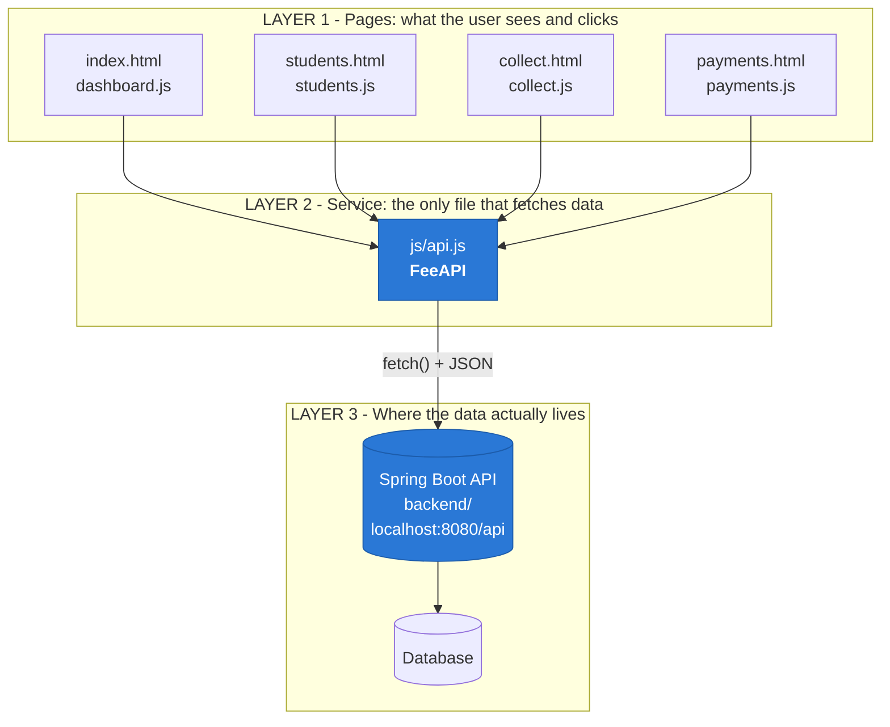
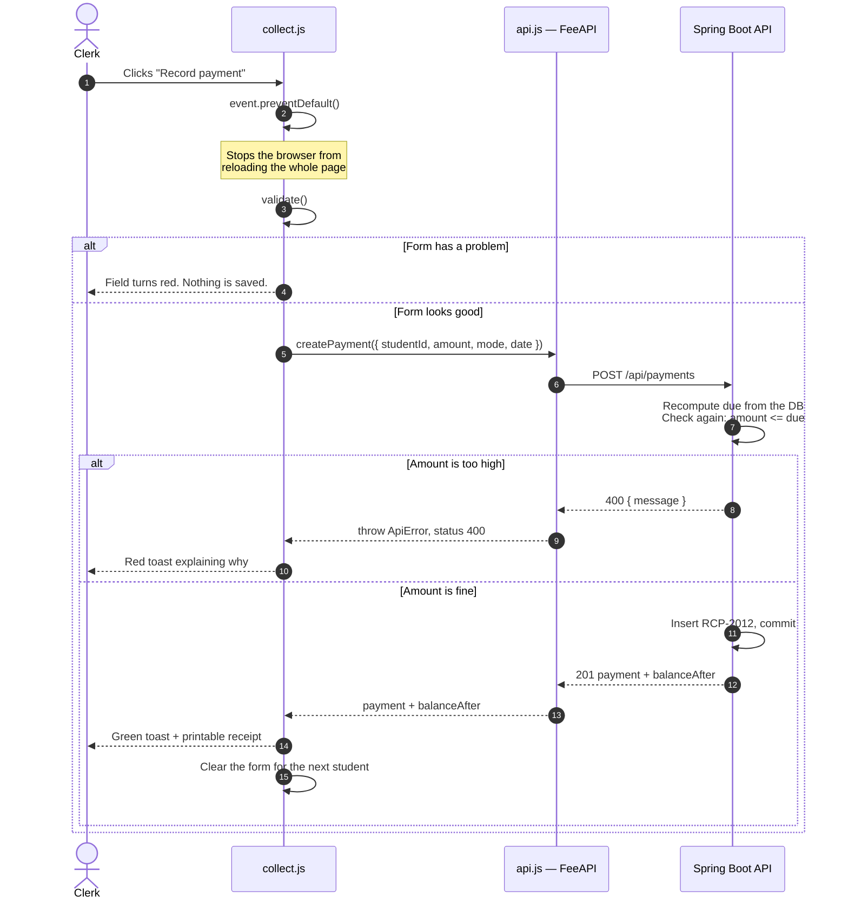
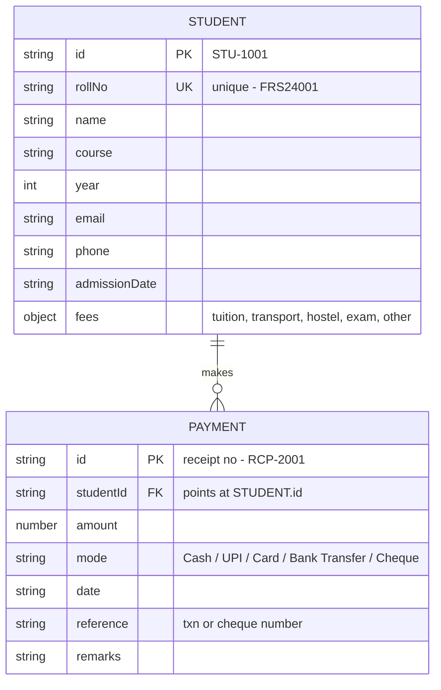
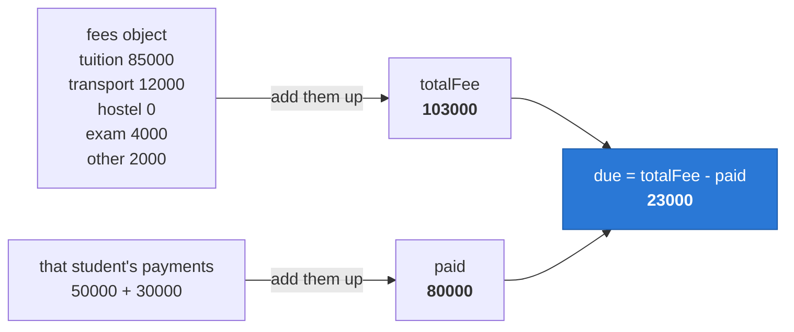
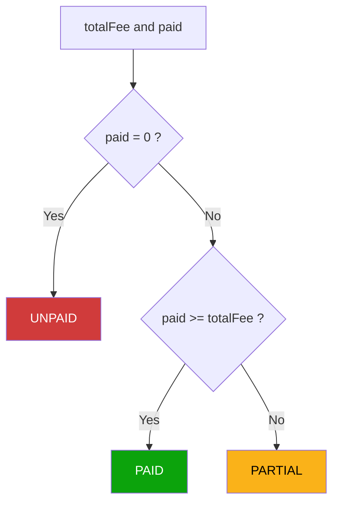
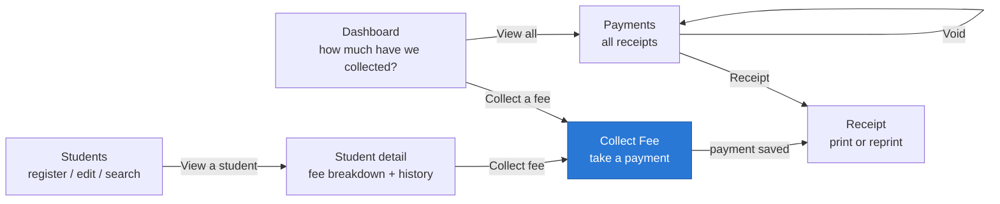
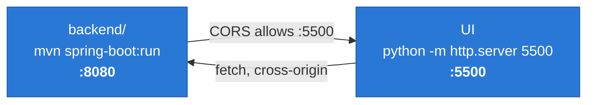

# How this project works

Diagrams for anyone picking up the Fee Registration System for the first time.

> **Previewing this file:** in VS Code press `Ctrl+Shift+V`. GitHub and GitLab
> render Mermaid automatically. Or paste any block into <https://mermaid.live>.

---

## 1. The three layers

The single most important idea in this codebase: **pages never touch data
directly.** They ask `FeeAPI`, and `FeeAPI` is the only thing that knows there is
a server at all.

**Read it like a restaurant:** the pages are the customer, `api.js` is the waiter,
and the backend is the kitchen. The customer only ever talks to the waiter — which
is why this app previously ran against a fake localStorage kitchen, and swapping in
the real one changed no page script, no HTML and no CSS.

---

## 2. What happens when a clerk records a payment

Follow one click all the way down and back.

### Why is the amount checked twice?

| Check | Lives in | Purpose |
|---|---|---|
| First | `collect.js` | **Convenience.** Tell the user instantly, before any round trip. |
| Second | the API | **Safety.** A form can be bypassed with DevTools. |

Front-end validation is a helpful suggestion. The server's validation is the
actual rule — which is why the server recomputes the balance from the database
rather than trusting any figure the browser sends it.

---

## 3. The data model

Only two kinds of record exist. One student can have many payments, because fees
are usually paid in instalments.

---

## 4. Money is calculated, never stored

`totalFee`, `paid` and `due` are **not** columns. The server works them out fresh
on every read and sends them down with each student, so the browser never does
money arithmetic.

**Why not just store `due`?** Because the moment someone voids a receipt, a stored
`due` becomes a lie unless you remember to update it everywhere. Deriving it makes
being out of sync *impossible*. General rule: **don't store what you can derive.**

The fee status badge falls out of the same two numbers:

---

## 5. How a clerk moves through the app

---

## 6. Running the two halves

The UI and the API are separate processes on separate ports, so both must be up.

**Open the UI over HTTP, never from disk.** A `file://` page sends `Origin: null`,
the API's CORS policy rejects it, and every screen fails to load with an error
that looks like the server is down when it isn't.

The endpoint list and exact JSON shapes are in the
[README](../README.md#endpoints-the-api-exposes).

---

## Where to start reading the code

1. [`js/api.js`](../js/api.js) — the whole client half of the contract, in one
   short file. Read `getStudents`, then `createPayment`.
2. [`js/collect.js`](../js/collect.js) — find `form.addEventListener('submit', ...)`
   and trace it against diagram 2 above.
3. `backend/src/main/java/com/enrollx/fee/payment/PaymentService.java` — the other
   side of diagram 2, including the balance check that actually counts.
