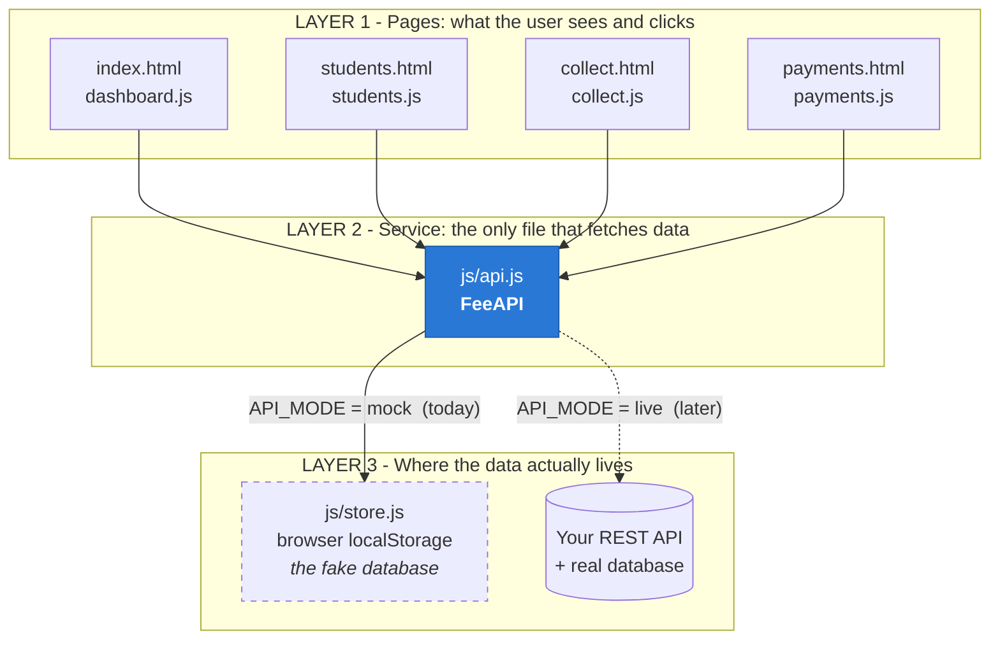
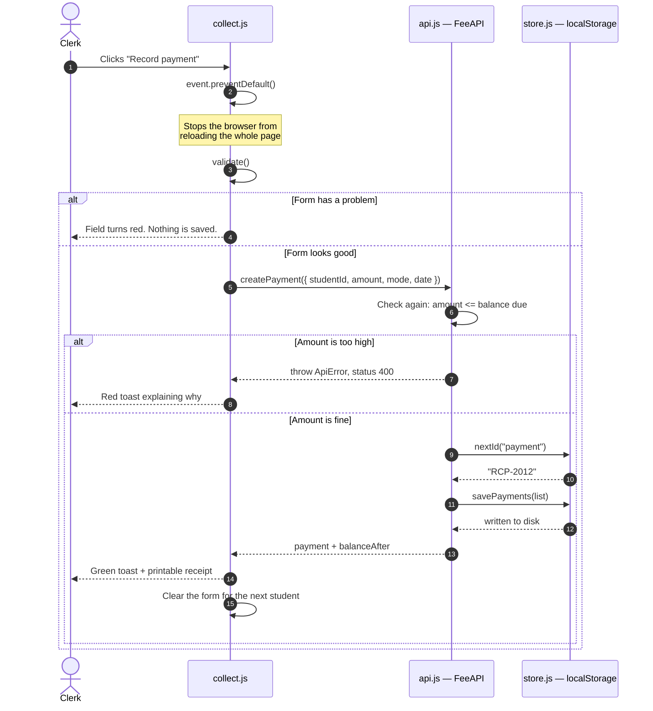
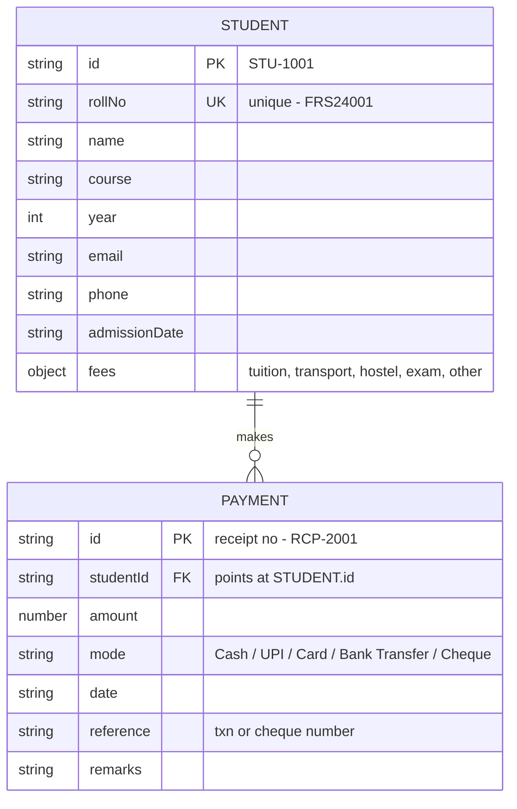
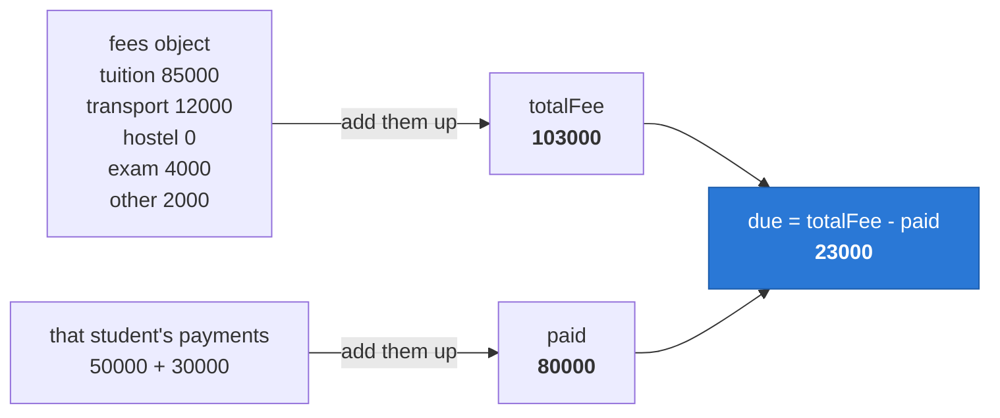
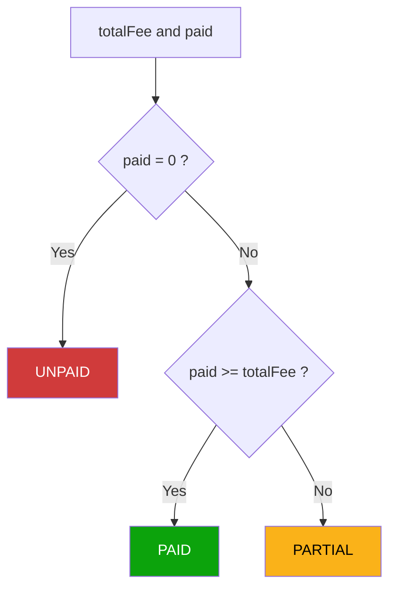
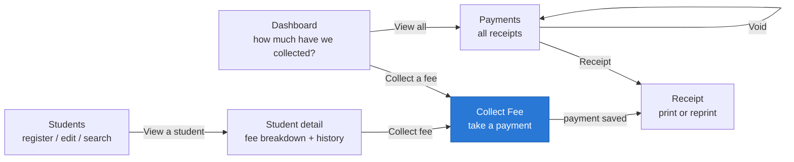
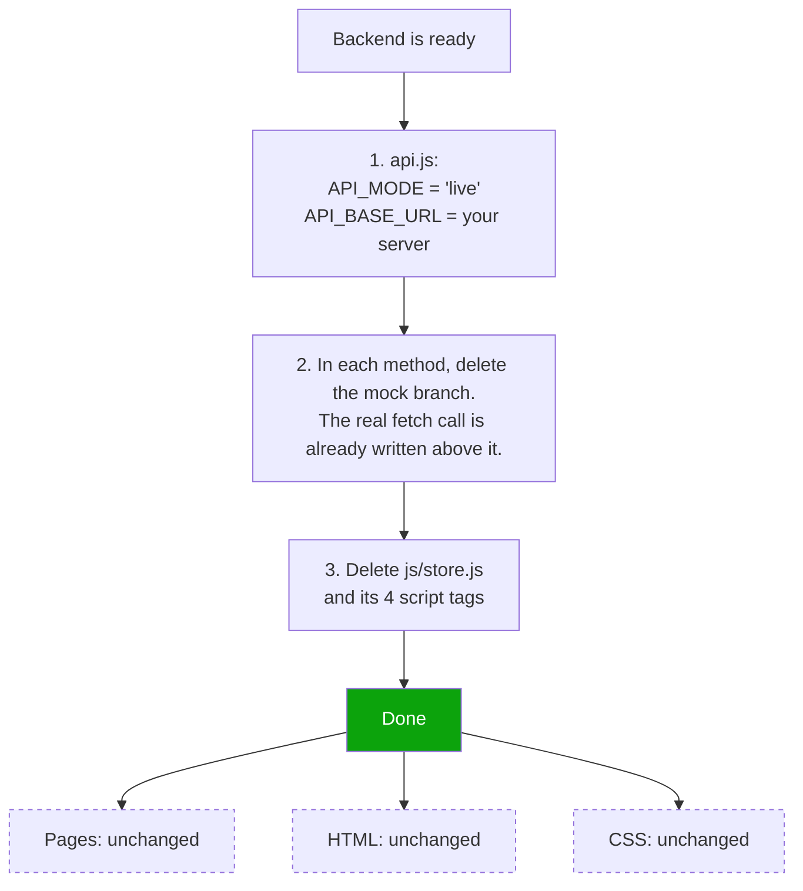

# How this project works

Diagrams for anyone picking up the Fee Registration System for the first time.

> **Previewing this file:** in VS Code press `Ctrl+Shift+V`. GitHub and GitLab
> render Mermaid automatically. Or paste any block into <https://mermaid.live>.

---

## 1. The three layers

The single most important idea in this codebase: **pages never touch data
directly.** They ask `FeeAPI`, and `FeeAPI` decides where the data comes from.

That is why switching from localStorage to your real backend is a one-file change.



**Read it like a restaurant:** the pages are the customer, `api.js` is the waiter,
and `store.js` is a temporary kitchen. Replace the kitchen and the customer never
notices, because the customer only ever talks to the waiter.

---

## 2. What happens when a clerk records a payment

Follow one click all the way down and back.



### Why is the amount checked twice?

| Check | Lives in | Purpose |
|---|---|---|
| First | `collect.js` | **Convenience.** Tell the user instantly, before any round trip. |
| Second | `api.js` | **Safety.** A form can be bypassed with DevTools. |

Front-end validation is a helpful suggestion. The server's validation is the
actual rule. When your real backend arrives, it must enforce this too.

---

## 3. The data model

Only two kinds of record exist. One student can have many payments, because fees
are usually paid in instalments.



---

## 4. Money is calculated, never stored

`totalFee`, `paid` and `due` are **not** columns. They are worked out fresh every
time, in `decorate()` inside [`js/api.js`](../js/api.js).



**Why not just store `due`?** Because the moment someone voids a receipt, a stored
`due` becomes a lie unless you remember to update it everywhere. Deriving it makes
being out of sync *impossible*. General rule: **don't store what you can derive.**

The fee status badge falls out of the same two numbers:



---

## 5. How a clerk moves through the app



---

## 6. Going live: what changes



Each method in `api.js` already looks like this — the real call is written and
waiting, just switched off:

```js
getStudents: function (filters) {
  if (isLive()) {
    return request('/students', { query: filters });   // <-- the real call
  }
  return mock(function () {
    /* the localStorage version - delete this branch */
  });
}
```

The endpoint list and exact JSON shapes your server must return are in the
[README](../README.md#endpoints-the-server-needs-to-expose).

---

## Where to start reading the code

1. [`js/api.js`](../js/api.js) — read `getStudents`, then `createPayment`.
2. [`js/collect.js`](../js/collect.js) — find `form.addEventListener('submit', ...)`
   and trace it against diagram 2 above.

Those two files are about 80% of the project.
